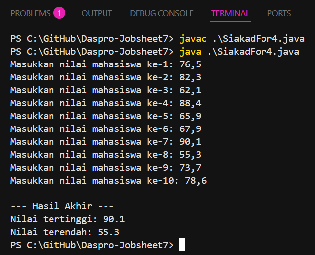
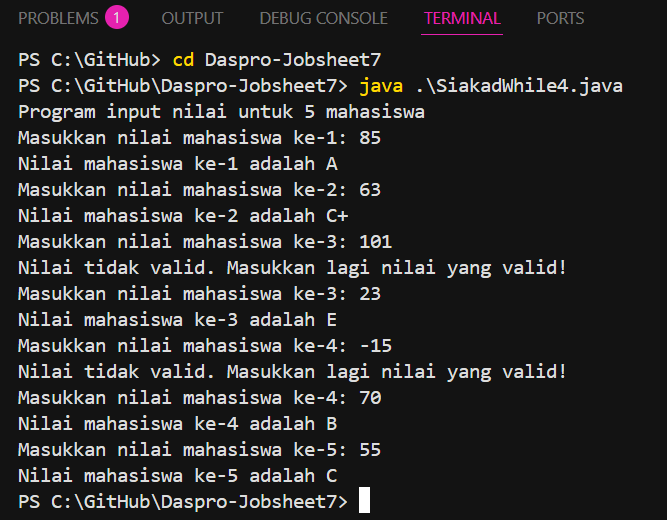
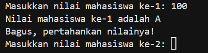
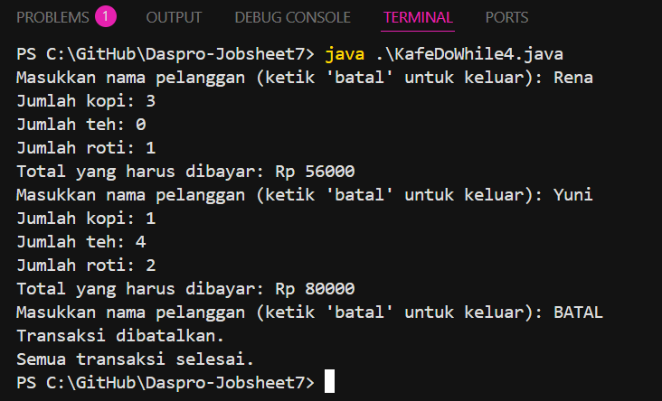

# JOBSHEET 7

# PERCOBAAN 

## - Percobaan 1 : Studi Kasus Nilai Mahasiswa di SIAKAD – Perulangan FOR

_Pertanyaan:_

1. Sebutkan dan tunjukkan masing-masing komponen perulangan FOR pada kode program
Percobaan 1!
2. Mengapa variabel tertinggi diinisialisasi 0 dan terendah diinisialisasi 100? Apa yang
terjadi jika variabel tertinggi diinisialisasi 100 dan terendah diinisialisasi 0?
3. Jelaskan fungsi dan alur kerja dari potongan kode berikut!
    ```java 
            if (nilai > tertinggi) {
                tertinggi = nilai;
            }
            if (nilai < terendah) {
                terendah = nilai;
            }
    ```
4. Modifikasi kode program sehingga terdapat perhitungan untuk menentukan berapa
mahasiswa yang lulus dan yang tidak lulus berdasarkan batas kelulusan (nilai minimal 60).
Tampilkan jumlah mahasiswa lulus dan tidak lulus setelah menampilkan nilai tertinggi
dan terendah!
5. Commit dan push kode program ke Github

_Jawaban:_

1.  Komponen : Inisialisasi
    Bagian kode : 
    ```java 
    int i = 1
    ```
    Penjelasan : deklarasi dan inisialisasi variabel counter (variabel pengontrol perulangan). Menetapkan nilai awal variabel penghitung i menjadi 1. (Perulangan akan dimulai dari mahasiswa ke-1.)

    Komponen : Kondisi 
    Bagian kode : 
    ```java
    i <= 10
    ```
    Penjelasan : Batas atau syarat agar perulangan tetap dieksekusi. Pada bagian kode tersebut artinya program akan meminta input 10 kali

    Komponen : Increment/Decrement 
    Bagian kode : 
    ```java
    i++
    ``` 
    Penjelasan : Perubahan nilai variabel counter pada setiap putaran perulangan. Setelah satu kali perulangan selesai, nilai i akan bertambah 1. (Misalnya dari 1 → 2 → 3 … hingga 10.)
2.  Nilai tertinggi = 0
    Karena 0 adalah nilai terkecil yang mungkin dimasukkan, jadi jika ada nilai lebih besar dari 0, program bisa mencari mana yang paling tinggi.

    Nilai terendah = 100
    Karena 100 adalah nilai terbesar yang mungkin dimasukkan, jadi jika ada nilai lebih kecil dari 100, program bisa mencari mana yang paling rendah.

    Jika dibalik (tertinggi = 100 dan terendah = 0),
    hasilnya pasti salah, karena:
    - Nilai tertinggi akan selalu 100
    - Nilai terendah akan selalu 0
    Meskipun sebenarnya tidak ada mahasiswa yang nilainya seperti itu.
3.  Kode ini berfungsi untuk membandingkan nilai yang baru dimasukkan dengan nilai tertinggi 
    dan terendah yang sudah ada sebelumnya. Tujuannya untuk mencari nilai tertinggi dan nilai terendah dari semua data yang diinput.

    Alur kerja : 
    1. Setiap kali pengguna memasukkan nilai mahasiswa, program akan memeriksa dua hal:
    a. if (nilai > tertinggi)
    - Memeriksa apakah nilai yang baru dimasukkan lebih tinggi dari nilai tertinggi sebelumnya.
    - Jika ya, berarti ditemukan nilai yang lebih tinggi dan program mengganti nilai tertinggi dengan nilai baru itu.
    Contoh:
    - Sebelumnya nilai tertinggi = 80
    - Input baru nilai = 85
    Karena 85 > 80 maka tertinggi sekarang menjadi 85.

    b. if (nilai < terendah)
    - Memeriksa apakah nilai yang baru dimasukkan lebih rendah dari nilai terendah sebelumnya.
    - Jika ya, berarti ditemukan nilai yang lebih rendah dan program mengganti nilai terendah dengan nilai baru itu.
    Contoh:
    - Sebelumnya nilai terendah = 70
    - Input baru nilai = 65
    Karena 65 < 70 maka terendah sekarang menjadi 65.

    2. Setelah semua nilai dimasukkan (perulangan selesai), variabel tertinggi berisi nilai paling tinggi, dan terendah berisi nilai paling rendah dari seluruh data yang diinputkan. 
4. ```java
    import java.util.Scanner;

    public class SiakadFor4 {
    public static void main(String[] args) {
        Scanner sc = new Scanner(System.in);

        // Deklarasi variabel 
        double nilai, tertinggi = 0, terendah = 100;
        // Variabel untuk menghitung jumlah 
        int lulus = 0, tidakLulus = 0;

        // Perulangan FOR 
        for (int i = 1; i <= 10; i++) {
            System.out.print("Masukkan nilai mahasiswa ke-" + i + ": ");
            nilai = sc.nextDouble();
            if (nilai > tertinggi) {
                tertinggi = nilai;
            }
            if (nilai < terendah) {
                terendah = nilai;
            }
            // Memeriksa kelulusan 
            if (nilai >= 60) {
                lulus++;  // Menambahkan 1 pada jumlah lulus
            } else {
                tidakLulus++; // Menambahkan 1 pada jumlah tidak lulus 
            }
            }
            // Output 
            System.out.println("\n--- Hasil Akhir ---");
            System.out.println("Nilai tertinggi: " + tertinggi);
            System.out.println("Nilai terendah: " + terendah);
            System.out.println("Jumlah mahasiswa yang lulus: " + lulus);
            System.out.println("Jumlah mahasiswa yang tidak lulus: " + tidakLulus);

            sc.close();
        }
    }
    ```

## - Percobaan 1 : Verifikasi Hasil Percobaan 



## - Percobaan 2 : Studi Kasus Nilai Mahasiswa di SIAKAD – Perulangan WHILE

_Pertanyaan:_

1. Pada potongan kode berikut, tentukan maksud dan kegunaan dari sintaks berikut:
    ```java 
        if (nilai < 0 || nilai > 100) {
                System.out.println("Nilai tidak valid. Masukkan lagi nilai yang valid!");
                continue;
        }
    ```
    a. nilai < 0 || nilai > 100
    b. continue
2. Mengapa sintaks i++ dituliskan di akhir perulangan WHILE? Apa yang terjadi jika posisinya
dituliskan di awal perulangan WHILE?
3. Apabila jumlah mahasiswa yang dimasukkan adalah 19, berapa kali perulangan WHILE
akan berjalan?
4. Modifikasi kode program sehingga apabila terdapat mahasiswa yang mendapat nilai A,
program menampilkan pesan tambahan "Bagus, pertahankan nilainya"!
5. Commit dan push kode program ke Github

## - Percobaan 2 : Verifikasi Hasil Percobaan 



_Jawaban:_

1.  a. nilai < 0 || nilai > 100
    Maksud:
    Kondisi ini digunakan untuk memeriksa apakah nilai yang dimasukkan berada di luar rentang yang valid, yaitu kurang dari 0 atau lebih dari 100.

    Kegunaan:
    Simbol || artinya “atau” (operator logika OR).
    Jadi, kondisi akan benar (true) jika salah satu dari dua syarat terpenuhi:
    - nilai < 0 → nilai terlalu rendah (negatif)
    - nilai > 100 → nilai terlalu tinggi
    
    Jika kondisi ini benar, maka dianggap nilai tidak valid dan program menampilkan pesan: 
    Nilai tidak valid. Masukkan lagi nilai yang valid!

    b. continue
    Maksud:
    Perintah continue digunakan di dalam perulangan (loop) seperti while atau for.

    Kegunaan:
    Ketika baris continue; dijalankan, program akan:
    - Langsung melompat ke awal perulangan berikutnya,
    - Melewati sisa kode di bawahnya dalam blok loop saat ini.

    pada kode
    ```java 
        if (nilai < 0 || nilai > 100) {
                System.out.println("Nilai tidak valid. Masukkan lagi nilai yang valid!");
                continue;
        }
    ```
    Artinya : Jika nilai tidak valid akan menampilkan pesan peringatan, kemudian lewati proses (seperti pemeriksaan nilai huruf), dan melanjutkan ke pengulangan mahasiswa.
2.  Karena i++ berfungsi untuk menambah nilai penghitung (counter) setiap kali satu putaran
    perulangan selesai.
    
    Tujuannya agar:
    - Nilai i bertambah setelah satu siklus kerja selesai (misalnya setelah input nilai satu mahasiswa).
    - Kondisi while (i < jml) akan berhenti setelah jumlah pengulangan terpenuhi.

    Jadi, i++ diletakkan di akhir perulangan supaya setiap iterasi berjalan lengkap dulu, baru penghitung naik untuk masuk ke mahasiswa berikutnya.
3.  Penjelasan:
    - Nilai awal i = 0
    - Kondisi perulangan: i < jml → berarti selama i masih lebih kecil dari 19, perulangan akan terus berjalan.
    - Setiap kali perulangan selesai, i bertambah 1 (i++).
    - Ketika i menjadi 19, kondisi i < 19 menjadi false, sehingga perulangan berhenti.

    Kesimpulan : Perulangan WHILE akan berjalan sebanyak 19 kali. Karena perulangan dimulai dari 
    i = 0 dan berhenti sebelum i mencapai 19 sehingga total iterasi = 19 kali (dari 0 sampai 18).
4. ```java 
    import java.util.Scanner;

    public class SiakadWhile4 {
    public static void main(String[] args) {
        Scanner sc = new Scanner(System.in);

        // Deklarasi Variabel 
        int nilai; 
        int jml = 5;
        int i;

        i = 0;

        System.out.println("Program input nilai untuk " + jml + " mahasiswa");
        // System.out.print("Masukkan jumlah mahasiswa: ");
        // jml = sc.nextInt();

        while (i < jml) {
            System.out.print("Masukkan nilai mahasiswa ke-" + (i + 1) + ": ");
            nilai = sc.nextInt();

            if (nilai < 0 || nilai > 100) {
                System.out.println("Nilai tidak valid. Masukkan lagi nilai yang valid!");
                System.out.print("Masukkan nilai mahasiswa ke-" + (i + 1) + ": ");
                nilai = sc.nextInt();
            }
            if (nilai > 80 && nilai <= 100) {
                System.out.println("Nilai mahasiswa ke-" + (i + 1) + " adalah A");   
                System.out.println("Bagus, pertahankan nilainya!");             
            } else if (nilai > 73 && nilai <= 80) {
                System.out.println("Nilai mahasiswa ke-" + (i + 1) + " adalah B+");
            } else if (nilai > 65 && nilai <= 73) {
                System.out.println("Nilai mahasiswa ke-" + (i + 1) + " adalah B");
            } else if (nilai > 60 && nilai <= 65) {
                System.out.println("Nilai mahasiswa ke-" + (i + 1) + " adalah C+");
            } else if (nilai > 50 && nilai <= 60) {
                System.out.println("Nilai mahasiswa ke-" + (i + 1) + " adalah C");
            } else if (nilai > 39 && nilai <= 50) {
                System.out.println("Nilai mahasiswa ke-" + (i + 1) + " adalah D");
            } else {
                System.out.println("Nilai mahasiswa ke-" + (i + 1) + " adalah E");
            }
            i++;
        }
        sc.close();
        }
    }
    ```
    Output : 

     

## - Percobaan 3 : Studi Kasus Transaksi di Kafe – Perulangan DO-WHILE

_Pertanyaan:_

1. Pada penggunaan DO-WHILE ini, apabila nama pelanggan yang dimasukkan pertama kali
adalah “batal”, maka berapa kali perulangan dilakukan?
2. Sebutkan kondisi berhenti yang digunakan pada perulangan DO-WHILE tersebut!
3. Apa fungsi dari penggunaan nilai true pada kondisi DO-WHILE?
4. Mengapa perulangan DO-WHILE tersebut tetap berjalan meskipun tidak ada komponen
inisialisasi dan update?

## - Percobaan 3 : Verifikasi Hasil Percobaan 



_Jawaban:_

1.  Penjelasan : 
    Jika user/pengguna langsung mengetik "batal" saat pertama kali diminta nama pelanggan:
    - Program tetap menjalankan isi perulangan sekali (karena sifat do-while).
    - Lalu menemui kondisi if (namapelanggan.equalsIgnoreCase("batal")), sehingga break dieksekusi.
    - Setelah itu, keluar dari perulangan.

    Kesimpulan : Walaupun pengguna langsung mengetik “batal”, Perulangan tetap dilakukan satu kali sebelum berhenti.


 


     


